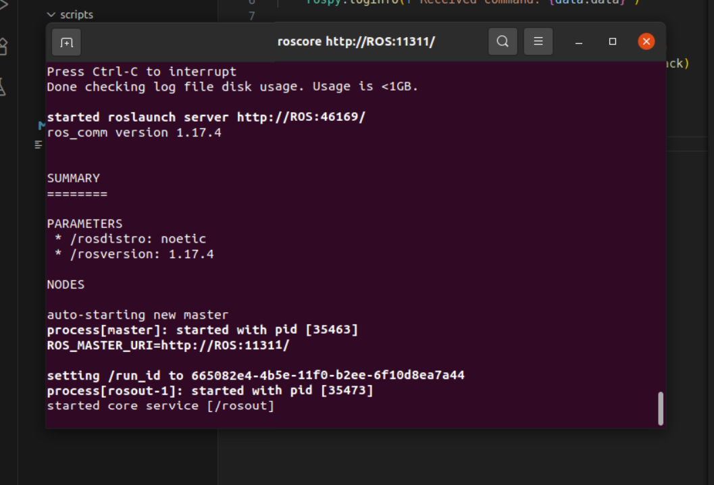
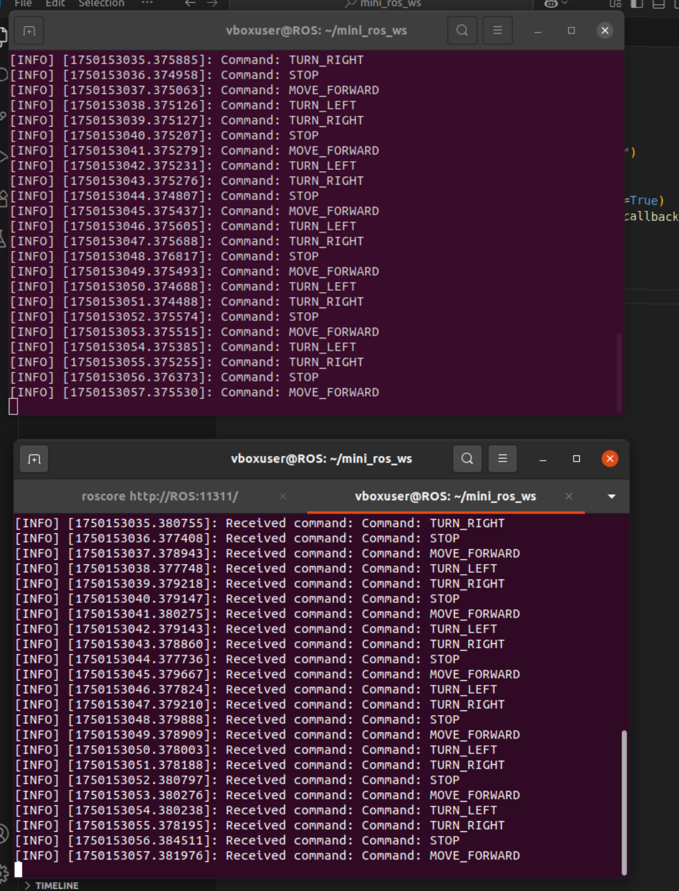

# 🧠 MiniROSBot — Simple ROS 2 Publisher/Subscriber Demo

A minimal ROS 2 project that demonstrates the core publish-subscribe architecture using Python. The project simulates a robot sending movement commands and a subscriber node listening for them in real time.

---

## 🚀 Overview

This project contains:
- A **publisher node**: sends mock robot movement commands (`MOVE_FORWARD`, `TURN_LEFT`, etc.).
- A **subscriber node**: listens to those commands and logs them.
- Runs at **1Hz**, making it easy to observe real-time messaging in ROS.

Ideal for beginners learning how ROS 2 nodes and topics work.

---

## 📦 Tech Stack

- **ROS 2 Humble** (can also work on Rolling/Foxy with minor changes)
- **Ubuntu 22.04+** (Tested on Ubuntu 24.04 with ROS 2 Humble)
- **Python 3**

---

## 📁 Project Structure

mini_ros_ws/

├── src/

│ └── mini_rosbot/ 

│ ├── scripts/

│ │ ├── robot_publisher.py

│ │ └── robot_subscriber.py

│ └── package.xml

└── README.md


---

## 🛠️ Setup Instructions

### 1️⃣ Install ROS

### 2️⃣ Clone the Repo
```bash
cd ~/mini_ros_ws/src
git clone https://github.com/sanjay872/mini-ros-bot
cd ..
colcon build
source install/setup.bash
```

### 3️⃣ Make the Python Scripts Executable
```bash
chmod +x src/mini_rosbot/scripts/*.py
```

### ▶️ How to Run
In Terminal 1:
```bash
source ~/mini_ros_ws/install/setup.bash
ros2 run mini_rosbot robot_publisher
```

In Terminal 2:
```bash
source ~/mini_ros_ws/install/setup.bash
ros2 run mini_rosbot robot_subscriber
```

## 📌 Sample Output

ROS Running


Publisher and Subscriber


## 💡 Learning Concepts
- ROS 2 Node Basics

- Topic Publishing & Subscribing

- Real-time simulation and logging

- Python scripting in ROS 2

- Workspace and package structure